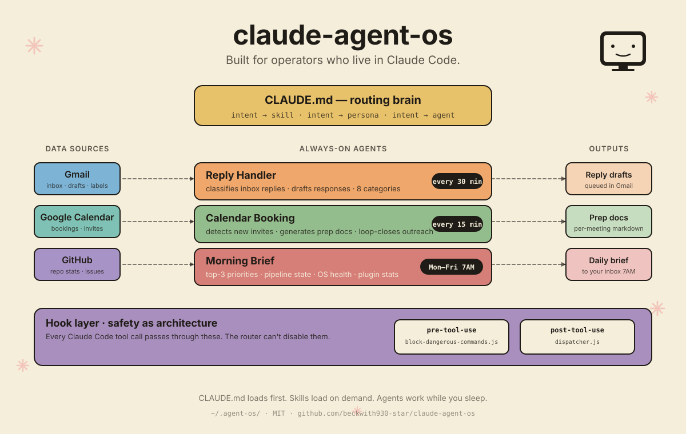

# claude-agent-os

> A persistent operating layer for Claude Code — always-on, directory-scoped.

<p align="center">
  
</p>

`claude-agent-os` is a directory that sits at `~/.agent-os/` and gives Claude Code the persistence it doesn't have on its own: a routing brain that maps intent to skills and personas, three background agents wired to launchd that process your inbox and calendar on a cadence, and a hook layer that blocks dangerous commands before they run. Output lands as drafts you approve — nothing sends, deletes, or pushes without you. Built for one operator, sharable to many.

## Who this is for

- **Solo founders and operators** who already live in Claude Code and want one source of truth across sessions instead of re-priming every chat.
- **AEs and GTM engineers** who need inbox + calendar + outbound to behave like a system, not three disconnected tools.
- **Devs** who prefer their automation layer in plain files on disk (markdown, Python, plist) rather than a hosted dashboard.

## Who this is NOT for

- Teams looking for a managed SaaS with a UI, SSO, and a CSM — this is a local-first OSS project, not a vendor.
- Anyone who wants agents that send, post, or commit without human review — every output here is a draft by design, and that's not a toggle.

---

## Install in 60 seconds

```bash
curl -fsSL https://raw.githubusercontent.com/beckwith930-star/claude-agent-os/main/install.sh | bash
```

Or clone and run locally:

```bash
git clone https://github.com/beckwith930-star/claude-agent-os.git ~/.agent-os
cd ~/.agent-os && ./install.sh
```

The installer:

1. Clones the framework to `~/.agent-os/`
2. Prompts for a **namespace** (used for Gmail labels, launchd job names, MCP server name)
3. Creates `~/.agent-os/secrets/` with `700` perms
4. Makes scripts + hooks executable
5. Installs three launchd plists (reply-fetcher, booking-fetcher, morning-brief)
6. Runs `scripts/os-health.py` to verify

You're not done — see [`docs/setup-secrets.md`](docs/setup-secrets.md) to wire Gmail OAuth. Until that's done, the agents are inert.

---

## Architecture

```
~/.agent-os/
├── CLAUDE.md              # Routing brain — intent → skill/persona/agent
├── BRAND.md               # Positioning (12 canonical sections)
├── SOUL.md                # Voice reference
├── MEMORY.md              # Append-only campaign log (gitignored)
├── CONNECTIONS.md         # Auth-boundary rules
├── settings.json          # Permissions, hooks, model defaults
├── agents/
│   ├── brand-auditor.md   # Audits BRAND.md for gaps
│   ├── reply-handler.md   # Processes inbox replies
│   ├── calendar-booking.md# Generates prep docs for new bookings
│   ├── morning-brief.md   # Mon–Fri 7 AM priority memo
│   └── personas/          # enterprise-ae, gtm-engineer, solo-founder
├── hooks/
│   ├── pre-tool-use/      # Blocks dangerous commands
│   ├── post-tool-use/     # Auto-stages git, runs auditors
│   └── notification/      # Surfaces approval requests
├── scripts/
│   ├── audit-brand.py     # Checks BRAND.md against 12 sections
│   ├── fetch-replies.py   # Polls Gmail for replies, classifies, queues
│   ├── fetch-bookings.py  # Polls Gmail for calendar invites, queues
│   ├── morning-brief.py   # Aggregates state → Gmail draft to self
│   ├── hunter-enrich.py   # Email enrichment via Hunter.io
│   └── os-health.py       # Verifies every component is wired
├── launchd/               # Plist templates for the three always-on jobs
└── secrets/               # OAuth + API keys (700 perms, gitignored)
```

### The three always-on agents

| Agent | Cadence | What it does |
|---|---|---|
| **Reply Handler** | every 30 min | Polls Gmail for replies to tracked outbound, classifies (bounce / OOO / interested / objection / referral / polite-no), applies labels, queues to `inbox-queue.jsonl` for review |
| **Calendar Booking** | every 15 min | Detects new Google Calendar invites, parses .ics fields, cross-references against `outbox/sent-tracking.json` for loop closure, queues prep work |
| **Morning Brief** | Mon–Fri 07:00 | Aggregates state from queues, sent-tracking, MEMORY tail, brand audit, OS health, GitHub stats. Derives top-3 priority actions. Drops a single styled email to your inbox |

### Two-script pattern

Event-reactive agents (reply, booking) ship as a **dumb-fast launchd fetcher** + a **smart Claude processor**:

- **Fetcher** (Python): polls the source, does keyword classification, applies labels, queues to JSONL. Cheap, idempotent, no LLM.
- **Processor** (Claude session): invoked on-demand via `/handle-replies` or `/process-bookings`. Reads the queue, generates drafts with full context, updates tracking.

This keeps cost low (no LLM on a cron) and quality high (full reasoning when humans engage).

### Hook layer

Every Claude Code action passes through:

- `pre-tool-use/block-dangerous-commands.js` — refuses `rm -rf`, `git push --force` on main, destructive DB commands without WHERE, etc.
- `post-tool-use/dispatcher.js` — routes to sub-hooks (auto-stage git, re-run brand auditor on doc writes)
- `notification/notify-permission.js` — surfaces approval requests with structured context

---

## Customization

The shipped templates are skeletons. Make it yours:

1. **`BRAND.md`** — fill the 12 canonical sections. Run `python3 ~/.agent-os/scripts/audit-brand.py` to check.
2. **`SOUL.md`** — describe your voice. Demo cadence, DM tone, words you do/don't use.
3. **`CLAUDE.md`** — extend the intent-routing table to map your slash commands to your skill files.
4. **`agents/personas/`** — edit the three personas to match your roles.
5. **Add your own agents** — drop new `.md` specs in `agents/`, reference them from `CLAUDE.md`.

The `<NS>` placeholder is the namespace you picked during install. It appears in:
- Gmail labels (`<NS>/reply/bounce`, `<NS>/booking/new`, `<NS>/morning-brief`)
- launchd job labels (`io.<NS>.morning-brief`)
- MCP server name (`gmail-<NS>`)

The installer replaces `<NS>` in canonical docs at install time. For places it doesn't reach (agent specs, scripts), use grep + sed.

---

## Hard safety rules (built in)

- **Drafts only.** Every outbound artifact (email, DM, post, CRM write) lands in a draft state. The human pulls every send trigger.
- **Auth boundary.** `CONNECTIONS.md` defines allowed/forbidden accounts. The router enforces this before any Chrome, Gmail, GitHub, or CRM action.
- **Pre-tool-use hook is sacred.** It is the last line of defense against destructive commands. Never disable it.
- **Secrets stay local.** `~/.agent-os/secrets/` is gitignored and 700-perm. Never paste secrets in chat.

---

## Status

This is **v0.1** — built and used in production by one operator (the author) running a solo venture. It works for that case. It will need adaptation for yours. Issues + PRs welcome.

## License

[MIT](LICENSE). Use it, fork it, ship it.

## Author

[Brandon Beckwith](https://github.com/beckwith930-star)
